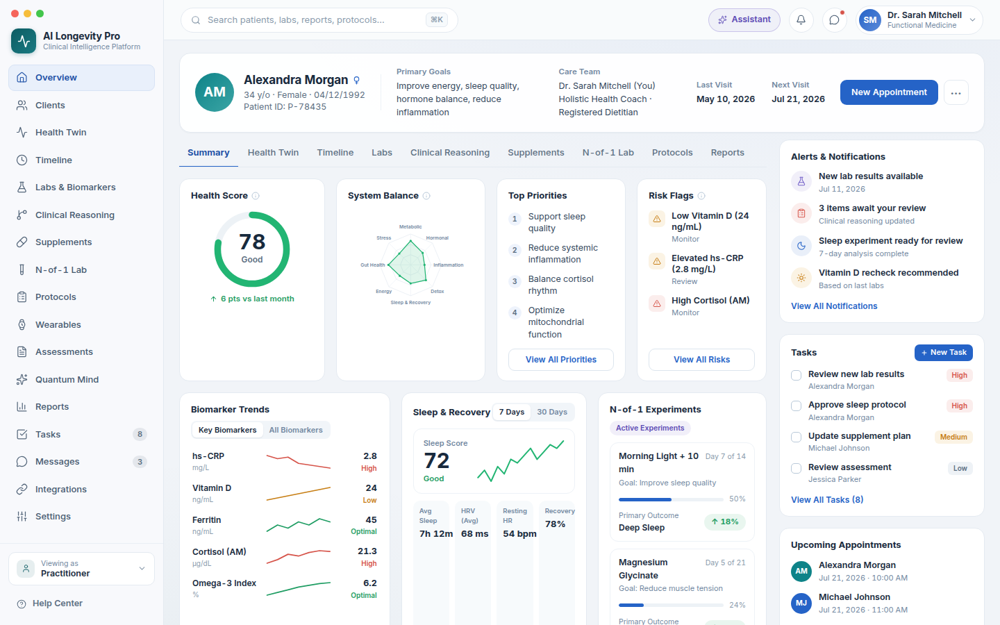
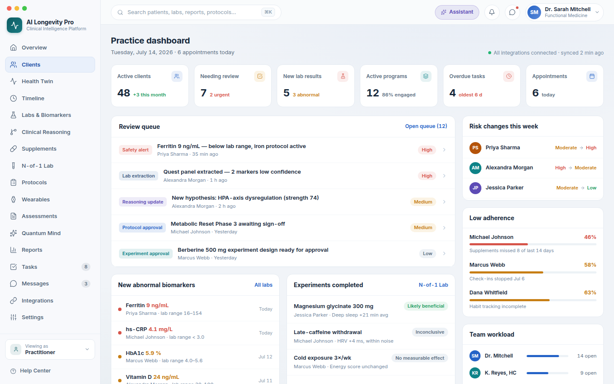
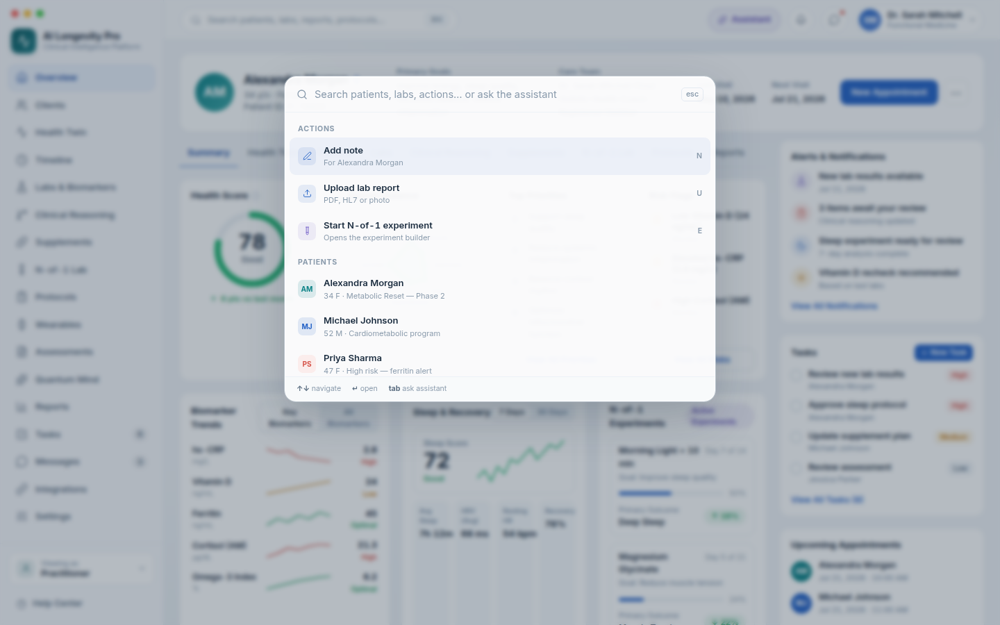

# AI Longevity Pro — Clinical Intelligence (Desktop)

Desktop-first practitioner web application for a premium longevity /
functional-medicine practice. It combines patient health intelligence (labs,
biomarkers, sleep and wearables, supplements, N-of-1 experiments) with
practice operations (review queue, tasks, appointments, team workload) and a
differentiated AI layer (clinical reasoning snapshot, evidence for/against,
contextual assistant, command palette).

This repository contains the **Phase 1 front end**, recreated in
high fidelity from the design handoff in
[`docs/design-handoff/`](docs/design-handoff/README.md)
(`Clinical Intelligence v2.dc.html` is the primary visual reference).
There is **no backend yet** — all data comes from clearly isolated, typed
mock adapters designed to be swapped for tRPC queries later.



## Stack

- [Next.js 15](https://nextjs.org) (App Router) + React 19 + TypeScript
- Tailwind CSS v4 (design tokens declared in `src/app/globals.css`)
- [lucide-react](https://lucide.dev) icons
- Inter (variable) via `next/font`

## Getting started

```bash
npm install
npm run dev        # http://localhost:3000
```

Other scripts: `npm run build` · `npm run start` · `npm run lint` ·
`npm run typecheck`.

The app targets a 1440×900 desktop viewport (1280 px minimum supported
width).

## What's in Phase 1

| Area | Status |
| --- | --- |
| App shell — 236 px sidebar (17 sections, badges), 58 px top bar, glass/solid material modes, atmospheric background | ✅ Live |
| Patient Overview (`/patients/:id/summary`) — flagship screen: header card, tabs, health score ring, system-balance radar, priorities, risk flags, biomarker trends, sleep & recovery, active N-of-1 experiments, Clinical Reasoning Snapshot, right rail (alerts / tasks / appointments) | ✅ Live |
| Practice Dashboard (`/practice`) — stat row, review queue, abnormal biomarkers, completed experiments, risk changes, low adherence, team workload | ✅ Live |
| Command palette — ⌘K / Ctrl+K, filtering, ↑↓ + ↵ keyboard navigation, Tab hands off to the assistant, Esc / backdrop closes | ✅ Live |
| Clinical Assistant drawer — provenance-labelled output (Measured / Patient-reported / AI inference), sources used, missing information, review-status notice | ✅ Live |
| Remaining sections (Health Twin, Timeline, Labs, Clinical Reasoning workspace, Supplements, N-of-1 Lab, Protocols, Reports, Wearables, Assessments, Quantum Mind, Tasks & Review Queue, Messages, Integrations, Calendar, Program Builder, Settings) | 🔜 Designed placeholders — build from [`docs/design-handoff/product-spec.txt`](docs/design-handoff/product-spec.txt) |

Six synthetic patients ship with the mock adapters; Alexandra Morgan
(`p-78435`) carries the exact flagship dataset from the handoff, and the
other records are derived from the practice-dashboard data so cross-links
stay coherent. **All health data is synthetic.**

## Architecture

```
src/
  adapters/        Typed mock data layer — THE swap point for tRPC later
    types.ts         Domain interfaces shared with the UI
    *.mock.ts        Synthetic datasets (patients, practice, assistant, commands)
    index.ts         `api` façade shaped like the future tRPC client
  app/             App Router routes (patient tabs, practice, placeholders)
  components/
    shell/           Sidebar, TopBar, CommandPalette, AssistantDrawer, AppShell
    patient/         Patient header, tabs, right rail, summary cards
    practice/        Practice dashboard cards
    ui/              Card, charts (ring / radar / sparkline), segmented control…
  lib/             Routes, providers (material + shell UI state), tone maps
```

See [`docs/architecture.md`](docs/architecture.md) for the route map, data
flow, and the tRPC swap plan.

### Design system notes

- Tokens (colors, borders, ink scale) are declared as Tailwind v4 `@theme`
  variables in `src/app/globals.css`; data-driven colors go through the
  semantic tone maps in `src/lib/tones.ts`.
- Color semantics are binding: blue = action / practitioner-confirmed,
  teal = patient-reported, violet = AI / inference, green = positive,
  amber = warning, coral = critical, navy = measured.
- Surfaces support `solid | glass` material (glass adds
  `backdrop-filter: blur(22px) saturate(1.5)` to the sidebar, top bar and
  patient header). Glass is the shipped default per the handoff; toggle it
  under **Settings → Appearance**.
- Tabular numerals everywhere numbers appear; Inter variable 400–700
  (true 650 for active tabs).
- Reduced motion is respected globally; focus rings are visible on all
  interactive elements (violet for assistant controls).

### AI guardrails (already enforced in the UI)

- Hypothesis strength chips are labelled *“Strength reflects internal
  evidence weighting — not a medical probability.”*
- Every assistant statement carries a provenance badge, plus sources used,
  date range, missing information, and a *“Not reviewed — assistant output
  requires practitioner review”* notice.
- Experiment conclusions use the cautious vocabulary only
  (*Likely beneficial · Possibly beneficial · No measurable effect ·
  Possibly harmful · Inconclusive*).

## Screenshots

| | |
| --- | --- |
|  |  |

## Roadmap

1. **Phase 2+ screens** from `product-spec.txt` — Client directory, Health
   Twin system map, three-pane Clinical Reasoning workspace, Labs workspace,
   Supplement Intelligence, N-of-1 Lab, unified Timeline, Program /
   Assessment builders, Tasks & Review Queue.
2. **Backend integration** — replace `src/adapters/*` with tRPC queries
   against the shared Hono/Supabase backend (see the platform development
   plan; the desktop app must share domain schemas with the Expo patient
   app rather than duplicating them).
3. Auth, organizations and patient-access authorization, audit logging —
   prerequisites before any real patient data flows through this UI.
