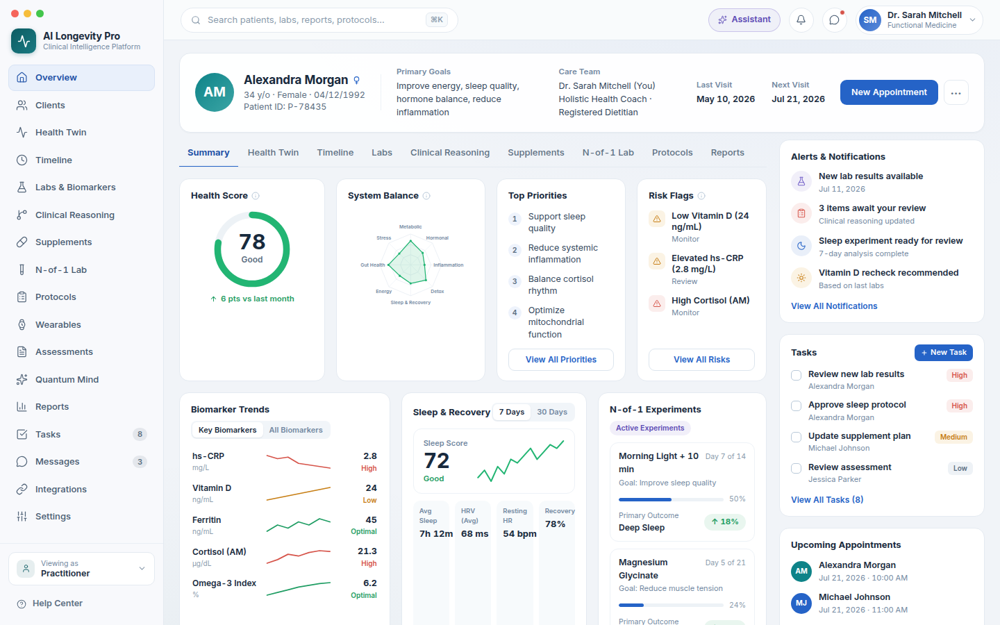
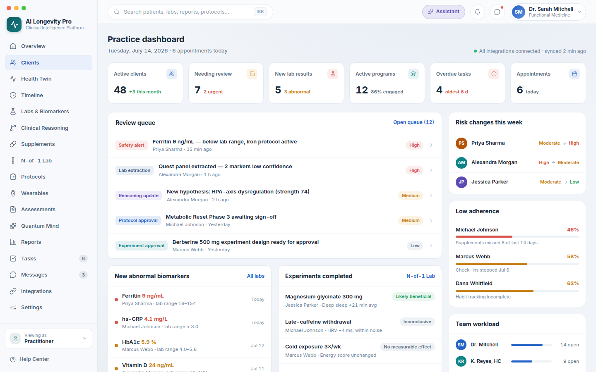
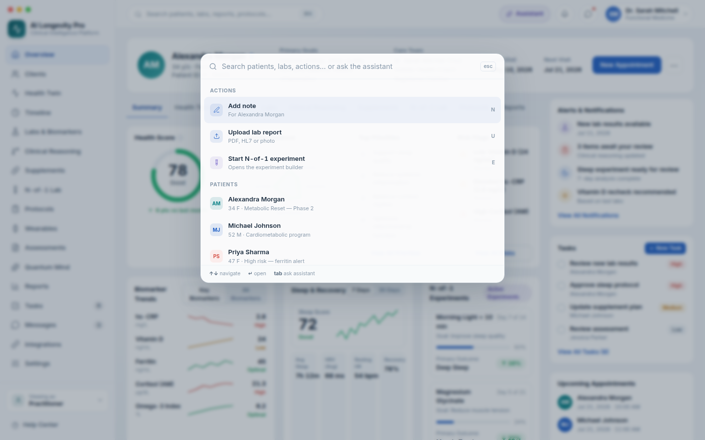

# AI Longevity Pro — Clinical Intelligence (Desktop)

Desktop-first practitioner web application for a premium longevity /
functional-medicine practice. It combines patient health intelligence (labs,
biomarkers, sleep and wearables, supplements, N-of-1 experiments) with
practice operations (review queue, tasks, appointments, team workload) and a
differentiated AI layer (clinical reasoning snapshot, evidence for/against,
contextual assistant, command palette).

This repository owns the **desktop application**, its server-side clinical
boundary, and the **clinical database schema** (`supabase/`). The UI renders
through isolated, typed adapters (`src/adapters/*`) that support demo and live
modes. The clinical knowledge registry is the first live slice routed through
Desktop-owned server code to Supabase under the practitioner's JWT and RLS.
AI Longevity Pro remains a separate repository; see
[`ADR 0003`](docs/architecture-decisions/0003-desktop-backend-separation.md).



## Practitioner OS — information architecture (2026-07 overhaul)

The app presents as a practice operating system. The sidebar carries
**practice-level destinations only** — Today (default home), Calendar,
Patients, Review Queue, Inbox, Programs, Billing, Reports, Integrations,
Team, Settings — and everything patient-scoped lives in ONE local tab
system inside the chart: Overview · Chart & Timeline · Labs & Reasoning ·
Protocol · Nutrition · Supplements · Tracking & Experiments · Appointments · Messages · Billing ·
Files. Old URLs (including `/clients`, `/messages`, `/practice`,
`/audit-log`, `/ai-safety`, and every legacy patient tab) redirect to
their new homes — see
[`docs/information-architecture.md`](docs/information-architecture.md)
for the full route map, redirect table, and mock/live boundary rules.

Newly built mock-first surfaces (typed adapters + session stores, all
synthetic): the Today daily brief, the appointment drawer (front-desk
actions), the patient profile + longitudinal chart timeline, Care Plan
with a Passio-shaped nutrition boundary (key server-side only), Tracking
& Experiments (systems-model trajectories, N-of-1, wearables, Mind &
Cognition, assessments), the three-pane Inbox (portal channel; SMS/email
honestly unconfigured), Programs Studio with a review-gated AI Program
Copilot, the Stripe **test-mode-labeled** POS + ledgers, the role-aware
report catalog, and Integrations (connections / automations / webhooks /
sync log — no connection is ever faked). Governance (AI registry + audit
log) lives under **Settings → Security & Governance**; templates are a
contextual versioned library at `/templates`.

The patient **Labs & Reasoning → Clinical copilot** view adds a governed,
deterministic prototype of adaptive intake → differentiating questions →
confirming-lab candidates → exact-product protocol drafting. Product candidates
cannot enter a protocol until core safety information is present, the
practitioner marks the output reviewed, and the current manufacturer label is
explicitly verified. Affiliate links remain hidden during clinical selection;
all generated plans stay draft-only and session-only. The versioned pathway
workflow lives at **Settings → Clinical Knowledge Center**; its preview and
persistent database contract are documented in
[`docs/clinical-knowledge-registry.md`](docs/clinical-knowledge-registry.md).
The adjacent **Import review** view stages the de-identified practitioner
authoring pack as reviewable pathway drafts and blocked product-label
candidates; affiliate metadata never becomes clinical approval.

## Stack

- [Next.js 15](https://nextjs.org) (App Router) + React 19 + TypeScript
- Tailwind CSS v4 (design tokens declared in `src/app/globals.css`)
- [lucide-react](https://lucide.dev) icons
- Inter (variable) via `next/font`

## Getting started

```bash
npm install
npm run dev        # http://localhost:3000  (demo mode — no env needed)
```

Other scripts: `npm run build` · `npm run start` · `npm run lint` ·
`npm run typecheck` · `npm run test:unit`.

**End-to-end tests (Playwright, mock app):**

```bash
npx playwright install chromium   # once, downloads the test browser
npm run build                     # the suite runs the production server
npm run test:e2e                  # mock-app + practitioner-os suites (41 tests)
npm run test:e2e:headed           # same, with a visible browser
```

The suites live in [`e2e/mock-app.spec.ts`](e2e/mock-app.spec.ts) and
[`e2e/practitioner-os.spec.ts`](e2e/practitioner-os.spec.ts) and need no
backend or env vars. In sandboxed CI images with a pre-installed browser, point
`PW_CHROMIUM_PATH` at the Chromium binary instead of running `playwright install`.

**Demo vs live.** With no env, the app runs entirely on mock/session adapters —
nothing is persisted and no sign-in is needed. Setting
`NEXT_PUBLIC_USE_LIVE_API=true` (plus the server env in
[`.env.example`](.env.example)) routes practitioner authentication,
organization selection and membership management, and patient-directory reads
through this app's Desktop-owned Supabase boundary under the practitioner's JWT
and RLS. Labs, tasks, scheduling, encounters, scribe, lens, and the append-only
audit trail still use the transitional tRPC transport while each domain is
migrated. Practitioners sign in at `/login` through an httpOnly cookie session;
see
[`docs/live-auth-and-seeding.md`](docs/live-auth-and-seeding.md) for sign-in
and demo-data seeding). See [`docs/live-api.md`](docs/live-api.md) for the
architecture, the secure write path (migrations `0013`–`0015`), what's wired vs
still mock, and security assumptions. Settings → **Data source & environment**
shows the resolved mode, the practitioner session, and configured data-source vars
(presence only). [`docs/live-data-readiness.md`](docs/live-data-readiness.md)
maps every domain (adapter → mock source → session state → live tables → first
mutation) and the recommended wiring order.

The app targets a 1440×900 desktop viewport (1280 px minimum supported
width).

## What's in Phase 1

| Area | Status |
| --- | --- |
| App shell — grouped sidebar (Workspace / Clinical / Operations / System), 58 px top bar with working notifications / messages / account popovers, glass/solid material, atmospheric background | ✅ Live |
| Patient Overview (`/patients/:id/overview`) — header card with working actions, tabs, health score ring, system-balance radar, priorities, risk flags, biomarker trends, sleep & recovery, N-of-1 experiments, right rail | ✅ Live |
| **Review-to-action** — reusable `ActionBar` on cards / hypotheses / queue rows / lab markers; destructive & patient-facing actions confirm; outcomes announced and audited | ✅ Live |
| **Provenance & confidence** — reusable `Provenance` / `ProvenanceBadge` (source type, range, completeness, conflicts, review state) across summary, reasoning, assistant, tasks, labs | ✅ Live |
| **Clinical Reasoning Snapshot** — per-hypothesis provenance + actions, missing info, what-changed, safety considerations; **approve/reject updates the visible status in-session** and disables settled actions | ✅ Live (demo state) |
| **Note / report composer** — 8 draft types behind a mock adapter; drafts show sources / range / missing info / review state; never final until approved; patient-facing drafts confirm | ✅ Live (demo) |
| **Tasks & Review Queue** (`/tasks`) — 12 review categories, provenance per row, resolve / convert-to-note / request-data / open-patient / assign / snooze / change-priority, search + category + priority + status + my/all filters, empty state | ✅ Live (demo state) |
| **Imports & migration wizard** (`/imports`) — source → detect → map → resolve conflicts → preview → commit → audit; preserves `source_record_id`; links into the review queue | ✅ Live (demo) |
| **AI / decision-support safety registry** (`/ai-safety`) — per-feature classification with a no-regulatory-claims scope banner | ✅ Live |
| **Audit Log** (`/audit-log`) — demo session audit viewer, **survives reloads via `sessionStorage`**, clears with the session | ✅ Live (session) |
| System-of-record navigation + operational spec screens (Nutrition, Templates, Automations, Billing, Claims, Reports, Team) — honest workflow / permissions / next-action specs | ✅ Live |
| Today workspace (`/today`), Command palette (⌘K), Clinical Assistant drawer | ✅ Live |
| Appearance & accessibility — solid/glass material, atmospheric background, **display scale (compact / default / large)** | ✅ Live |
| Remaining sections (Health Twin, Timeline, Clinical Reasoning workspace, Supplements, N-of-1 Lab, Protocols, Reports tab, Wearables, Assessments, Quantum Mind, Messages, Integrations, Calendar, Program Builder) | 🔜 Placeholders — build from [`docs/design-handoff/product-spec.txt`](docs/design-handoff/product-spec.txt) |
| **Labs Workspace** (`/patients/:id/labs`) — marker table (lab + optimal ranges, confidence, review), trend panel, source inspector, extraction review, upload demo, optimal-range config | ✅ Live (demo) |

Six synthetic patients ship with the mock adapters; Alexandra Morgan
(`p-78435`) carries the exact flagship dataset from the handoff, and the
other records are derived from the practice-dashboard data so cross-links
stay coherent. **All health data is synthetic.**

## Demo persistence boundaries

Demo mode has no backend persistence. Its mutable state is isolated behind the
adapter facade so each domain can move to the Desktop-owned live boundary
without changing its components:

- **Review outcomes** (approve / reject / accept hypothesis / resolve queue
  item / mark lab reviewed) and the **audit log** are stored in the browser's
  `sessionStorage` via `src/adapters/session-store.ts`. They survive page
  reloads **within a browser session** and are **cleared when the session
  ends** — this is a demo, not a database. The Audit Log screen says so, and
  action toasts read "demo — not persisted".
- **Most demo reads** (patients, labs, queue, reasoning, composer drafts) come
  from typed mock adapters in `src/adapters/*`. Wired domains can be switched
  to live mode with `NEXT_PUBLIC_USE_LIVE_API`; the clinical knowledge registry
  then persists pathways and governed import decisions through the
  Desktop-owned Supabase boundary.

Each surface labels its actual persistence boundary. No demo UI copy implies
real persistence.

## Architecture

```
src/
  adapters/        Typed demo/live data boundary
    types.ts         Domain interfaces shared with the UI
    *.mock.ts        Synthetic datasets (patients, practice, assistant, commands)
    index.ts         `api` façade consumed by UI components
  app/             App Router routes (patient tabs, practice, placeholders)
  components/
    shell/           Sidebar, TopBar, CommandPalette, AssistantDrawer, AppShell
    patient/         Patient header, tabs, right rail, summary cards
    practice/        Practice dashboard cards
    ui/              Card, charts (ring / radar / sparkline), segmented control…
  lib/             Routes, providers (material + shell UI state), tone maps
```

See [`docs/architecture.md`](docs/architecture.md) for the route map and data
flow, and [`docs/desktop-identity-directory.md`](docs/desktop-identity-directory.md)
for the migrated identity and directory boundary.

### Design system notes

- Tokens (colors, borders, ink scale) are declared as Tailwind v4 `@theme`
  variables in `src/app/globals.css`; data-driven colors go through the
  semantic tone maps in `src/lib/tones.ts`.
- Color semantics are binding: blue = action / practitioner-confirmed,
  teal = patient-reported, violet = AI / inference, green = positive,
  amber = warning, coral = critical, navy = measured.
- Surfaces support `solid | glass` material (glass adds
  `backdrop-filter: blur(22px) saturate(1.5)` to the sidebar, top bar and
  patient header). Glass is the shipped default per the handoff; toggle it
  under **Settings → Appearance**.
- Tabular numerals everywhere numbers appear; Inter variable 400–700
  (true 650 for active tabs).
- Reduced motion is respected globally; focus rings are visible on all
  interactive elements (violet for assistant controls).

### AI guardrails (already enforced in the UI)

- Hypothesis strength chips are labelled *“Strength reflects internal
  evidence weighting — not a medical probability.”*
- Every assistant statement carries a provenance badge, plus sources used,
  date range, missing information, and a *“Not reviewed — assistant output
  requires practitioner review”* notice.
- Experiment conclusions use the cautious vocabulary only
  (*Likely beneficial · Possibly beneficial · No measurable effect ·
  Possibly harmful · Inconclusive*).

## Screenshots

| | |
| --- | --- |
|  |  |

## Roadmap

Historical platform prompts live in [`docs/platform/`](docs/platform/). ADR
0003 supersedes their shared-backend assumption: Desktop features remain in
this repository and AI Longevity Pro remains independent.

Shipped since the handoff (see the status table): review-to-action,
provenance, the Clinical Reasoning Snapshot upgrade, system-of-record
navigation, the composer, the imports wizard, the AI/CDS safety registry, the
session audit log, appearance/display-scale settings, the Tasks & Review
Queue, and the Labs Workspace.

For this desktop repo, in order:

1. **Remaining Phase 2+ screens** from `product-spec.txt` — Health Twin
   system map, three-pane Clinical Reasoning workspace, Supplement
   Intelligence, N-of-1 Lab, unified Timeline, Program / Assessment builders.
2. **Desktop-owned live integration** — migrate transitional adapters to
   same-origin Desktop server routes backed by the clinical Supabase project,
   one tested vertical slice at a time. Share stable contracts with other
   products without coupling their repositories or deployments.
3. **Ops surfaces from the addendum** (after the corresponding backend
   routers exist): Billing (invoices, payments, packages), insurance claims
   status, Automations rules + run history, connector-health Integrations
   screen, staged migration-import review, telehealth join links on
   appointments, and population/outcomes analytics views. These need design
   passes first — the approved v2 shell does not yet include them, so they
   must not be improvised into the sidebar.
4. **Trust surfaces** — the addendum's AI data-use guarantee ("processed
   in-region, never used to train external models") gets a visible home in
   the assistant UI and Settings once the config exists server-side.
